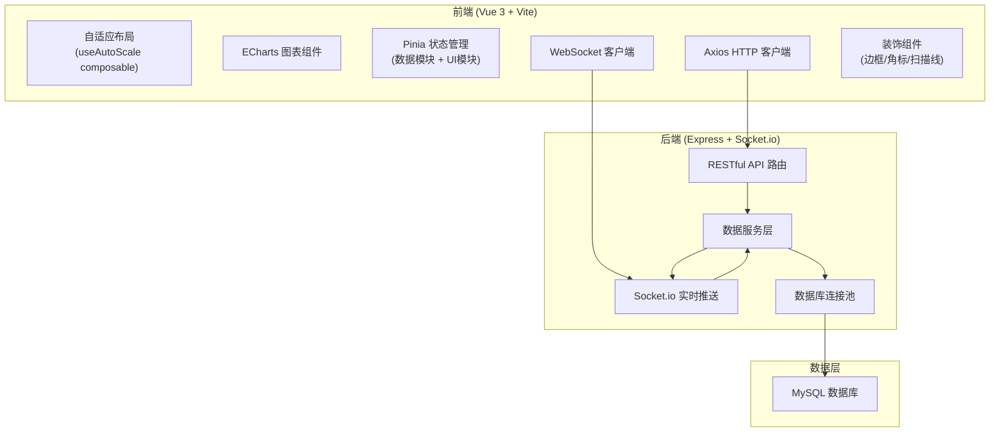
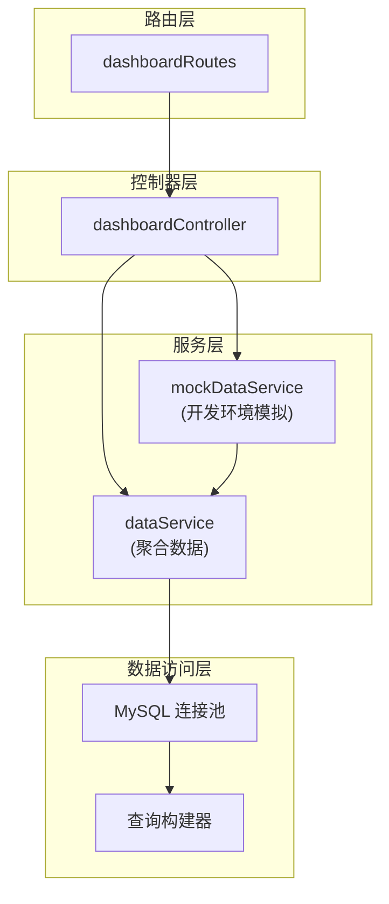
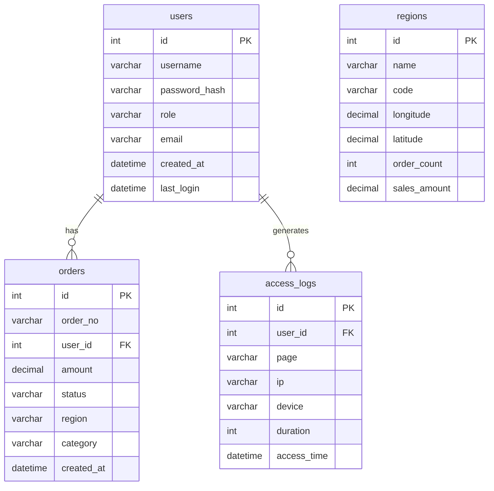

## 1. 架构设计



## 2. 技术说明

- **前端框架**：Vue 3.4+ (Composition API + `<script setup lang="ts">`)
- **构建工具**：Vite 5+
- **UI/可视化库**：ECharts 5+ (核心图表库)
- **样式方案**：SCSS (支持变量、嵌套、响应式，暗色科技风主题)
- **状态管理**：Pinia (分 dataStore、uiStore 两个模块)
- **HTTP 请求**：Axios (封装拦截器、统一错误处理)
- **实时通信**：原生 WebSocket / Socket.io-client
- **后端框架**：Express 4+ (Node.js 18+)
- **数据库**：MySQL 8+ (mysql2/promise 驱动 + 连接池)
- **初始化工具**：手动初始化 (Vite create + npm install)

## 3. 路由定义

| 路由 | 用途 |
|------|------|
| `/` | 大屏总览页面 (默认入口) |
| `/login` | 登录页面 (可选加分项) |

## 4. API 定义

### 4.1 RESTful API

```typescript
// 统一响应格式
interface ApiResponse<T> {
  code: number;    // 0 表示成功，非 0 表示错误
  data: T;
  message: string;
}

// 总览 KPI 数据
interface KpiData {
  totalSales: number;
  orderCount: number;
  activeUsers: number;
  conversionRate: number;
  salesGrowth: number;
  orderGrowth: number;
  userGrowth: number;
  rateChange: number;
}

// 趋势数据
interface TrendItem {
  time: string;
  value: number;
  category?: string;
}

// 排名数据
interface RankingItem {
  name: string;
  value: number;
  rank: number;
}

// 分布占比数据
interface DistributionItem {
  name: string;
  value: number;
  percentage: number;
}

// 地理分布数据
interface MapItem {
  name: string;
  value: number;
  longitude?: number;
  latitude?: number;
}

// API 端点
GET /api/dashboard/overview => ApiResponse<KpiData>
GET /api/dashboard/trend?range=24h|7d => ApiResponse<TrendItem[]>
GET /api/dashboard/ranking => ApiResponse<RankingItem[]>
GET /api/dashboard/distribution => ApiResponse<DistributionItem[]>
GET /api/dashboard/map => ApiResponse<MapItem[]>
```

### 4.2 WebSocket 推送消息格式

```typescript
// WebSocket 消息
interface WsMessage {
  type: 'kpi_update' | 'trend_update' | 'ranking_update' | 'distribution_update' | 'map_update' | 'heartbeat';
  data: any;
  timestamp: number;
}
```

## 5. 服务端架构



## 6. 数据模型

### 6.1 ER 图



### 6.2 数据定义语言 (DDL)

```sql
-- 创建数据库
CREATE DATABASE IF NOT EXISTS dashboard_db
  CHARACTER SET utf8mb4
  COLLATE utf8mb4_unicode_ci;

USE dashboard_db;

-- 用户表
CREATE TABLE IF NOT EXISTS users (
  id INT PRIMARY KEY AUTO_INCREMENT,
  username VARCHAR(50) NOT NULL UNIQUE,
  password_hash VARCHAR(255) NOT NULL,
  role ENUM('admin', 'viewer') DEFAULT 'viewer',
  email VARCHAR(100),
  created_at DATETIME DEFAULT CURRENT_TIMESTAMP,
  last_login DATETIME,
  INDEX idx_role (role),
  INDEX idx_created_at (created_at)
) ENGINE=InnoDB DEFAULT CHARSET=utf8mb4 COLLATE=utf8mb4_unicode_ci;

-- 订单表
CREATE TABLE IF NOT EXISTS orders (
  id INT PRIMARY KEY AUTO_INCREMENT,
  order_no VARCHAR(50) NOT NULL UNIQUE,
  user_id INT NOT NULL,
  amount DECIMAL(12,2) NOT NULL,
  status ENUM('pending', 'completed', 'cancelled') DEFAULT 'pending',
  region VARCHAR(50) NOT NULL,
  category VARCHAR(50) NOT NULL,
  created_at DATETIME DEFAULT CURRENT_TIMESTAMP,
  FOREIGN KEY (user_id) REFERENCES users(id),
  INDEX idx_region (region),
  INDEX idx_category (category),
  INDEX idx_created_at (created_at),
  INDEX idx_status (status)
) ENGINE=InnoDB DEFAULT CHARSET=utf8mb4 COLLATE=utf8mb4_unicode_ci;

-- 访问日志表
CREATE TABLE IF NOT EXISTS access_logs (
  id INT PRIMARY KEY AUTO_INCREMENT,
  user_id INT,
  page VARCHAR(100) NOT NULL,
  ip VARCHAR(45),
  device VARCHAR(50),
  duration INT DEFAULT 0,
  access_time DATETIME DEFAULT CURRENT_TIMESTAMP,
  FOREIGN KEY (user_id) REFERENCES users(id),
  INDEX idx_access_time (access_time),
  INDEX idx_page (page)
) ENGINE=InnoDB DEFAULT CHARSET=utf8mb4 COLLATE=utf8mb4_unicode_ci;

-- 地区表
CREATE TABLE IF NOT EXISTS regions (
  id INT PRIMARY KEY AUTO_INCREMENT,
  name VARCHAR(50) NOT NULL UNIQUE,
  code VARCHAR(20) NOT NULL UNIQUE,
  longitude DECIMAL(10,6),
  latitude DECIMAL(10,6),
  order_count INT DEFAULT 0,
  sales_amount DECIMAL(15,2) DEFAULT 0,
  INDEX idx_name (name),
  INDEX idx_code (code)
) ENGINE=InnoDB DEFAULT CHARSET=utf8mb4 COLLATE=utf8mb4_unicode_ci;

-- 初始化管理员账号（密码: admin123，生产环境需修改）
INSERT INTO users (username, password_hash, role, email)
VALUES ('admin', '$2b$10$...', 'admin', 'admin@example.com');
```
